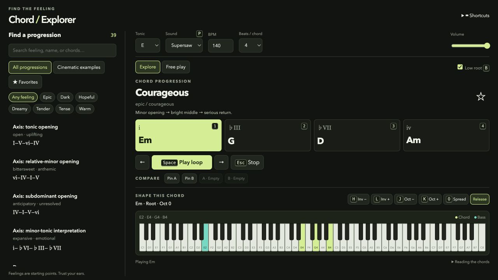

# Chord Explorer

Find a progression by feeling, then make it your own. A compact browser instrument with piano and supersaw, whole-loop playback, keyboard controls, and a live piano visualization.



## Start exploring

Open `index.html` in a modern browser, keeping the `js` directory and `styles.css` beside it. No build step, account, or sample downloads.

1. Pick a feeling or browse **All progressions**, **Cinematic examples**, and **Favorites**.
2. Select a progression and press **Space** to loop it.
3. Use **← / →** to compare candidates. During playback, the next choice takes over at the next chord boundary.
4. Star favorites or pin **A / B** to compare two progressions and their voicings.
5. Hold a chord number and adjust its inversion, octave, or spread while watching the piano.

All twelve tonics are available. Tempo defaults to 140 BPM with four beats per chord. Piano and supersaw use the same master-volume path as the original explorer.

## Keyboard controls

| Key | Explore | Free play |
| --- | --- | --- |
| 1–9 | Hold progression step | 1–7 hold natural-minor scale degree |
| Space | Play / pause loop | Hold / release selected chord |
| ← / → | Previous / next filtered candidate | Return to a library candidate |
| [ / ] | Hold previous / next step | Hold previous / next degree |
| H / L | Previous / next inversion | Same |
| J / K | Lower / raise upper voices | Same |
| O | Toggle spread | Same |
| P | Switch piano / supersaw | Same |
| B | Toggle low root | Same |
| Esc | Stop all notes and playback | Same |

Click outside a text input, dropdown, or slider before using shortcuts. Pointer and Enter-key chord buttons also work. The **Hold** button sustains the selected chord for shaping.

## Library and notation

The library contains 39 progressions, with a cinematic collection and mood filters to help you explore. Mood labels suggest what to listen for; they are not fixed emotional rules.

Numerals use major-referenced roots: in E, **i–♭III–♭VII–iv** is **Em–G–D–Am**. Chord quality is explicit, so **V** and **v** sound different. Changing the tonic transposes the pattern without changing its qualities.

Upper notes glow lime; the optional bass glows turquoise. Inversions move the upper voices independently of the low root.

Favorites persist in browser storage when available. A/B pins, voicings, and playback settings currently last for the session. Backgrounding the page stops playback. This is an audition tool, not a DAW or MIDI exporter; its timer is not a sample-accurate production sequencer.

## Code

```text
index.html          Semantic page structure
styles.css          Compact desktop and responsive mobile layout
js/chords.js        Pure chord parsing, transposition, and voicing
js/audio.js         Web Audio piano/supersaw synthesis
js/progressions.js  Curated catalog and provenance
js/app.js           Library, transport, input, and piano feedback
docs/research/      Source-backed research and editorial distinctions
```

All audio is synthesized locally. The piano is synthesized, not sampled. No framework, analytics, or backend.

To serve locally:

```sh
python3 -m http.server 8768
```

Open [localhost:8768](http://localhost:8768). To share the tool, send the whole repository or ZIP; localhost only works on your own computer.
