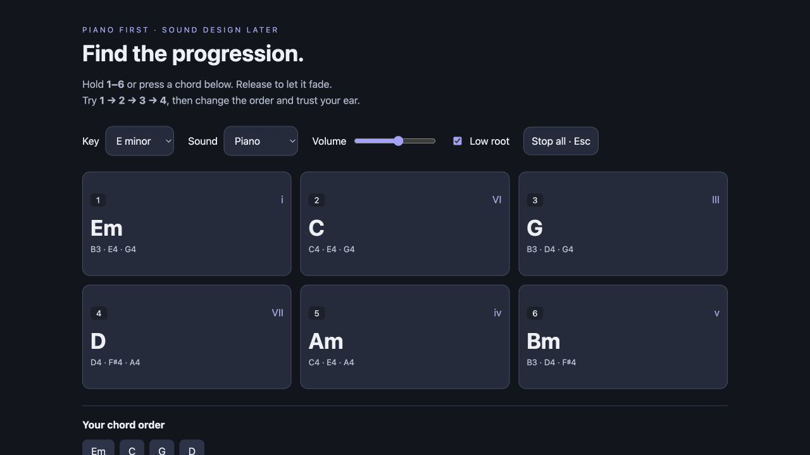
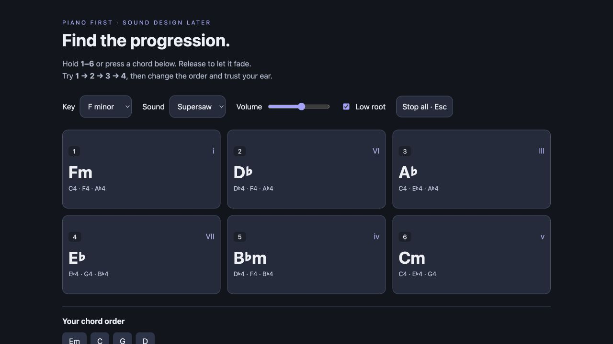

# Chord Explorer

**Find a chord progression by ear—one key per chord.** Hold number keys **1–6** to audition chords, switch between piano and supersaw, and try different orders without learning keyboard fingerings first.



## Try it in 30 seconds

1. [Download the ZIP](https://github.com/p4r7h-v/chord-explorer/archive/refs/heads/main.zip) and unzip it.
2. Open **index.html** in a modern browser. No install, account, or build step.
3. Click a chord to enable audio, then hold **1**, **2**, **3**, or **4**. Release to let it fade.

Click a blank area of the page before using number shortcuts if a dropdown or volume slider has focus. You can also hold the chord buttons with a mouse or touch.

## Same chords, different sound

Choose **Piano** to hear the harmony clearly, or **Supersaw** to audition a wider synth sound. Changing the sound keeps the same chord voicings.



### Start with these progressions

In **F minor**, the six keys give you:

| Key | Chord | Scale degree |
| --- | --- | --- |
| **1** | Fm | i |
| **2** | D♭ | VI |
| **3** | A♭ | III |
| **4** | E♭ | VII |
| **5** | B♭m | iv |
| **6** | Cm | v |

Try **1 → 2 → 3 → 4**, then **1 → 3 → 4 → 2**. Hold some chords longer to change the feel. The Key selector transposes all six buttons together.

## Controls

| Control | What it does |
| --- | --- |
| **1–6 / chord buttons** | Hold to play; release to fade |
| **Sound** | Piano-like synthesis or seven-voice stereo supersaw |
| **Key** | E, F, F♯, G, or D minor |
| **Low root** | Adds a lower root beneath the upper chord voicing |
| **Volume** | Adjusts the overall output |
| **Esc / Stop all** | Releases all active notes |
| **Your chord order** | Shows your last 24 chord presses |
| **Clear order** | Empties the chord history |

History records **order only**, not audio or timing, and resets on reload. The tool does not connect to a DAW or export MIDI.

## Under the hood

The app is a **single HTML file** containing its CSS and JavaScript. Web Audio oscillators generate every note locally: no sample downloads, libraries, analytics, or backend. The piano is a synthesized piano-like tone, not a sampled acoustic piano.

To serve it locally instead of opening the file directly:

```sh
python3 -m http.server 8768
```

Then open [localhost:8768](http://localhost:8768). This address works on your own computer; send friends the ZIP or repository link.
