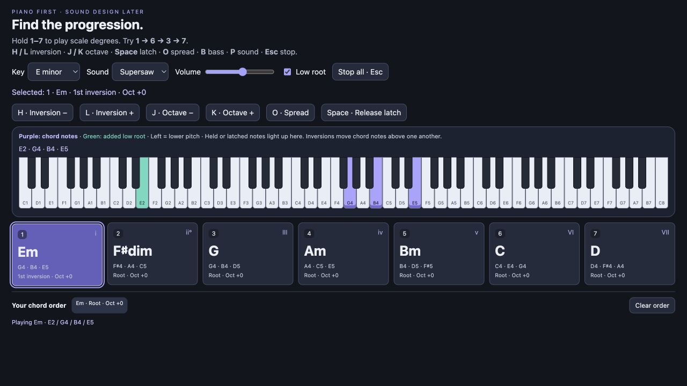

# Chord Explorer

**Find a chord progression by ear—one key per chord.** Hold number keys **1–7** to audition chords, switch between piano and supersaw, and try different orders without learning keyboard fingerings first.



## Try it in 30 seconds

1. [Download the ZIP](https://github.com/p4r7h-v/chord-explorer/archive/refs/heads/main.zip) and unzip it.
2. Open **index.html** in a modern browser. No install, account, or build step.
3. Click a chord to enable audio, then hold **1**, **2**, **3**, or **4**. Release to let it fade.

Click a blank area of the page before using number shortcuts if a dropdown or volume slider has focus. You can also hold the chord buttons with a mouse or touch.

## Same chords, different sound

Choose **Piano** to hear the harmony clearly, or **Supersaw** to audition a wider synth sound. Changing the sound keeps the same chord voicings.

The live piano highlights upper chord notes in **purple** and the optional low root in **green**. Watch the notes move as you change inversions and octaves.

### Start with these progressions

In **F minor**, the seven keys give you:

| Key | Chord | Scale degree |
| --- | --- | --- |
| **1** | Fm | i |
| **2** | Gdim | ii° |
| **3** | A♭ | III |
| **4** | B♭m | iv |
| **5** | Cm | v |
| **6** | D♭ | VI |
| **7** | E♭ | VII |

Try **1 → 6 → 3 → 7**, then **1 → 3 → 7 → 6**. Numbers now represent scale degrees; this replaces the original six-button layout.

## Explore voicings

Press **1**, then **Space** to latch the chord. Tap **L** to change its inversion and watch the highlighted piano notes move. Use **J / K** to change its octave, or **O** to spread its notes. Press **Space** again or **Esc** to release.

The last chord played becomes selected. Each chord remembers its own inversion, octave, and spread for the current session. The low root stays independent of the upper voicing. Switching to another chord releases the previous latch.

## Controls

| Control | What it does |
| --- | --- |
| **1–7 / chord buttons** | Hold to play; release to fade |
| **H / L** | Previous / next inversion of the selected chord |
| **J / K** | Lower / raise its upper voicing by an octave (−2 to +2) |
| **O** | Toggle spread voicing |
| **Space** | Latch / release the selected chord |
| **B** | Toggle low root |
| **P** | Switch piano / supersaw |
| **Sound** | Piano-like synthesis or seven-voice stereo supersaw |
| **Key** | E, F, F♯, G, or D minor |
| **Low root** | Adds a lower root beneath the upper chord voicing |
| **Volume** | Adjusts the overall output |
| **Esc / Stop all** | Releases all active notes |
| **Your chord order** | Shows your last 24 chord presses |
| **Clear order** | Empties the chord history |

History records **order only**, not audio or timing, and resets on reload. The tool does not connect to a DAW or export MIDI.

## Under the hood

The app is a **single HTML file** containing its CSS and JavaScript. Web Audio oscillators generate every note locally: no sample downloads, libraries, analytics, or backend. The piano is a synthesized piano-like tone, not a sampled acoustic piano. Supersaw voices use randomized starting phases to reduce synchronized onset swells. Some detuned movement is intentional.

To serve it locally instead of opening the file directly:

```sh
python3 -m http.server 8768
```

Then open [localhost:8768](http://localhost:8768). This address works on your own computer; send friends the ZIP or repository link.
